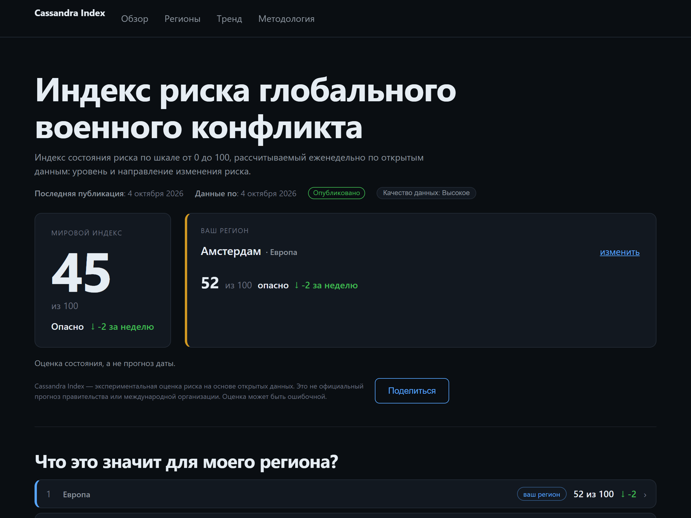
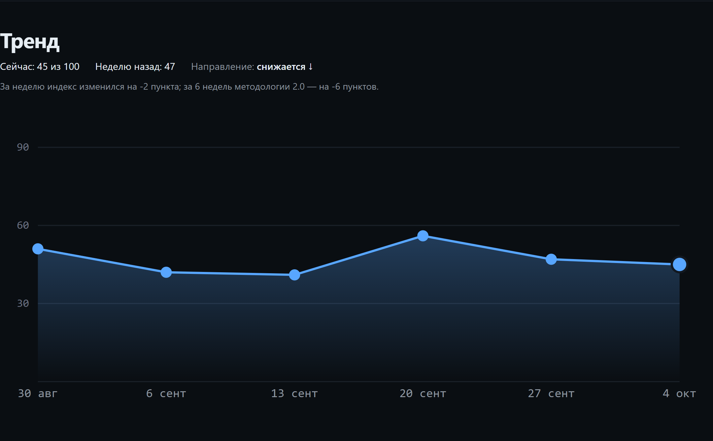
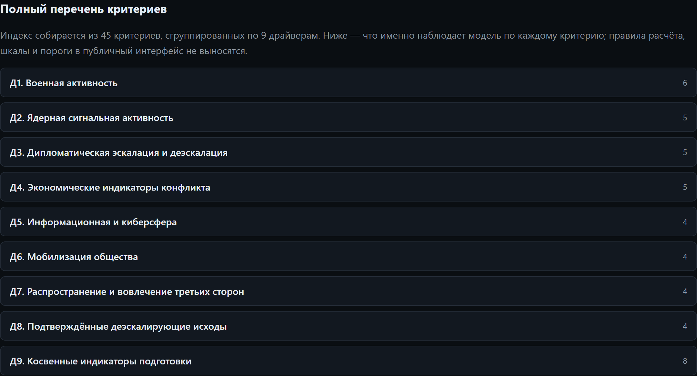
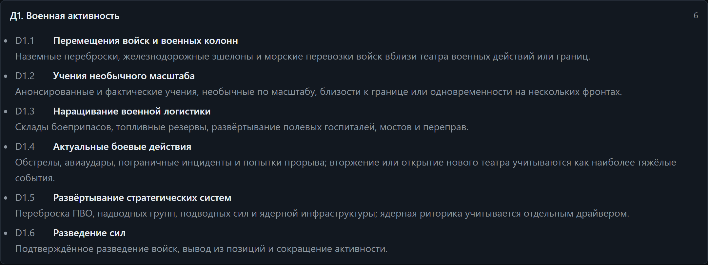
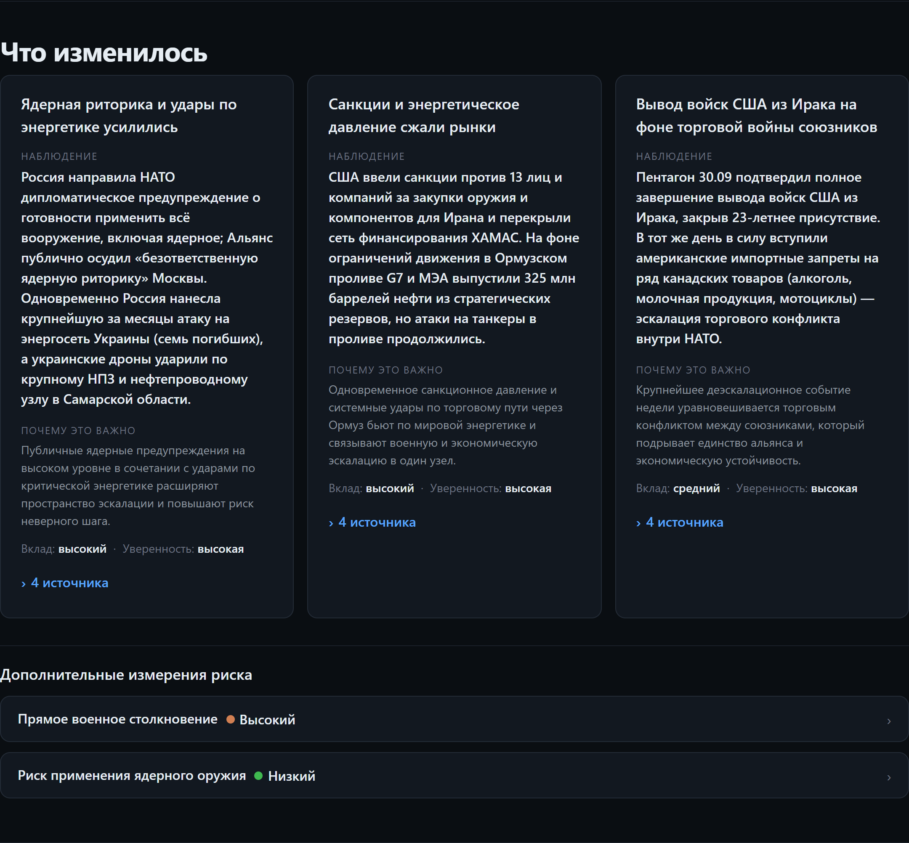

# 45 критериев, 9 драйверов и модель-классификатор Jev: как я собрал открытый еженедельный индекс риска глобального конфликта

Привет, Хабр!

Мы тонем в новостях. Голова кругом: тут говорят одно, там — противоположное, а где правда — непонятно.

Проблема не в том, что информации мало. Её слишком много. Проблема в другом: у неё нет структуры. Нет инструмента, который показывал бы, как риск меняется **во времени** — по открытым данным, а не по громкости заголовка.

Такого инструмента я не нашёл. Пришлось собрать самому.

Получился **Индекс Кассандры** — еженедельный сервис про уровень и направление риска глобального конфликта. Без регистрации. Без трекеров. Без подписок. Код, методика, данные и тесты открыты, лежат на GitHub. Сайт статический, на GitHub Pages.

Свежая неделя (4 октября 2026): **45, −2** к предыдущей (47). Ниже — как получается это число и как в него вошла новая модель-классификатор **Jev**.

Сразу оговорюсь: это рассказ об инженерной задаче — как устроен расчёт, как он проверяется и что даёт машинная классификация. Политических оценок и агитации здесь нет. Только измерение сигналов и метод.

*Главная: мировой индекс и региональный контекст — то, что видит человек, который открыл сайт и растерялся.*

## Почему Кассандра

Кассандра получила дар предвидения — и проклятие: ей никто не верил. Она предупреждала о падении Трои и о троянском коне. Её не слушали. Трагедия не в том, что она ошибалась. Она была права. Трагедия в том, что **у правды не было доказательств**.

Этот проект — про то же самое. Только вместо «поверьте мне» здесь другое: вот сигналы, вот источники, вот как из них получается число. Чтобы предупреждение можно было проверить, а не принять на веру.

Поэтому индекс и назван в её честь. Напоминание простое: **знать мало — надо ещё показать, откуда ты это знаешь**.

## Сразу про слона в комнате

Да, без ИИ не обошлось. Скрывать не буду: модель помогала писать код, а сейчас работает классификатором источников (детали — в разделе про Jev). Но тут важно не путать две вещи.

Первое — «нейрослоп»: текст сгенерировали, проверить забыли, факты выдуманы, лишь бы объём был. Второе — инженерный проект: ИИ тут инструмент, а решения и числа — на человеке. Эта статья про второе. Отвёртка за мебель не отвечает: стул развалится — ругать будут стул.

Что здесь человеческого:

- **задача и решения** — какие критерии важны, как агрегировать сигналы, как честно обрабатывать нехватку данных, как калибровать параметр на исторических якорях;
- **проверяемость** — у каждого числа есть источник, у каждой гипотезы — тест, у каждого пересчёта — запись в журнале аудита;
- **границы машины** — ИИ не двигает индекс, не выбирает источники и не решает, что публиковать.

Числа ниже я сверил со снапшотами, утверждения — с источниками. Ответственность за текст на мне.

Тест простой: откройте сайт. Понятна картина человеку без технического бэкграунда — значит, инструмент справляется. Кто что печатал — уже неважно.

## Что отдаёт сервис

Раз в неделю — четыре вещи:

- **уровень риска** — число;
- **направление** — вверх, вниз или без изменений;
- **состояние** — читаемое, без метафор «на грани»;
- **источники** — ссылки на то, откуда взяты сигналы.

Плюс тренд по неделям, региональные разрезы и список критериев с расшифровкой.

*Тренд показывает только точки методологии 2.0 — версии не смешиваются на одной оси. По оси X — даты расчёта индекса.*

## Что внутри: 9 драйверов, 45 критериев

Риск складывается из **9 драйверов**. В сумме они опираются на **45 критериев**. Каждый критерий — сигнал своего типа: военный, экономический, дипломатический, внутренний.

Что фиксируется по критерию за неделю? Значение. Покрыт ли он источниками. Ссылки.

*Полный перечень: 45 критериев, сгруппированных по 9 драйверам. Число справа — сколько критериев в драйвере (в сумме 45).*

*Тот же перечень можно раскрыть до уровня критерия — что именно наблюдает модель по каждому сигналу.*

Оценка драйвера считается отдельно. Дальше результаты агрегируются по открытой методике. Никакого машинного обучения и «умных предсказаний» — детерминированный движок на чистых функциях.

*Разбор недели: «что изменилось», «почему это важно», вклад и уверенность, ссылки на источники — у каждого утверждения.*

Что изменилось в методологии с первой версии статьи:

- **методология 2.0 и пересчитываемая цепочка.** Демо-недели ушли в архив, который не пересчитывается. Зато сплошным пересчётом считается вся цепочка из шести недель — историю можно воспроизвести с начала;
- **параметр `k = 1.95`.** Больше не «на глаз»: калибровка на 10 якорных профилях (6 отборочных + 4 проверочных), проверка на устойчивость к изменению ±20 %. Весь след — в журнале;
- **честная классификация недели.** Мало данных — неделя не уезжает в молчаливый «средний» индекс, а получает состояние `insufficient`/`reduced` с причиной. Пороги — в `calc/params.js`, код — в `calc/calc.js`;
- **`through` = дата самой недели.** Окно сигналов — W−7…W включительно. Дата «данные по» больше не копируется из прошлого снапшота;
- **слепые регионы держат отклонение.** Нет сигналов по региону — он не схлопывается в глобальный индекс, а сохраняет последнее отклонение от глобального фона;
- **тренд показывает только точки 2.0.** Версии методологий на одной оси не смешиваются.

И ещё. Критерий может остаться непокрытым. Нет надёжных данных за неделю — он помечается «слепым» и считается отдельно от покрытых. Честнее, чем тихо подставить ноль.

## Jev: модель-классификатор, которая читает источники вместо вас

Это ключевой раздел статьи.

Самое узкое место такого индекса — сбор входа. 45 критериев, десятки статей, всё вручную. «LLM разметит за вас» обычно кончается галлюцинациями. Поэтому классификатор я подключал с одной целью: **ускорить человека, а не заменить его решение**.

**Что такое Jev.** Это модель-классификатор из TypeSafe (System One). Длинных текстов она не пишет. Вместо этого выдаёт **атомарные типизированные суждения**: классификацию, оценку по шкале, вероятность, вердикт с доверием.

Подключается по MCP: `jev_classify`, `jev_score`, `jev_check`, `jev_gate`, `jev_decide`.

Почему это удобно? Такой ответ легко проверить кодом. На входе — состояние и вопросы со схемой, на выходе — типизированный результат, который можно сравнить с порогом.

**Принцип разделения.** Код владеет правилами, Jev даёт суждения:

1. **Классификация (Jev).** Текст раскладывается по критериям D1…D9. Релевантен ли он критерию? Какое поставить `value` и `covered`? Это событие окна W−7…W или тянущийся фон? Не продублировано ли одно событие в нескольких критериях? Каждое значение больше нуля обязано нести **дословную цитату** и ссылку. Нет цитаты → `not_found`. Правило жёсткое.
2. **Верификация (человек).** Редактор видит черновик: значение, цитата, ссылка. Подтверждает. Правит. Отбрасывает спорное. Решение о переносе критерия с прошлой недели — всегда за человеком.
3. **Детерминированный расчёт (код).** Дальше — только `calc/engine.js`. Никакого ИИ в формулах. Jev не двигает индекс ни на пункт: он ускоряет подготовку входа, а считает чистая математика.

**Почему я этому доверяю.** До подключения Jev я прогнал слепые ретро-прогоны по уже опубликованным неделям (27 сентября и 20 сентября 2026 года). Классификатор не видел ни человеческого входа, ни результатов. Итоги честные — и неприятные ровно настолько, насколько полезно.

- **ноль выдуманных фактов** на двух прогонах подряд — каждое значение > 0 с проверяемой цитатой, «лишних» покрытий не найдено ни одного;
- система цитат работает, но **слишком консервативна, когда статьи недоступны**. Из 74 URL классификатор дотянулся примерно до трети. Блокер пилота — не классификация, а доставка текстов: Reuters отдаёт 401 ботам, часть сайтов закрыта Cloudflare;
- расхождение итогового индекса с ручной разметкой — 6 и 17 пунктов. Оба раза причина в покрытии. Там, где текст был, оценки не расходились.

Статус на момент публикации: **Jev подключён как классификатор, идёт пилот.** Схема гибридная. Недоступные тексты докидывает человек. Дальше Jev классифицирует, человек верифицирует.

Критерии успеха зафиксированы заранее, в журнале пилота: индекс ±2 и тот же статус, экономия времени редактора ≥ 50 %. Отчитаюсь по факту, а не по обещаниям.

Вся логика — в документах проекта; статья их пересказывает, а не наоборот. `docs/jev-classification.md` — роли, правила, ворота, статус пилота. `docs/adr/0018-jev-source-classification.md` — почему выбран такой разделитель труда. `docs/governance.md` §10.1 — правила машинной разметки, обязательные для всех прогонов.

**Чего Jev не делает.** Не предсказывает будущее. Не «понимает геополитику». Не пишет тексты для сайта. Он классифицирует — и за каждое суждение отдаёт цитату и доверие, которые я могу отклонить.

## Стек: ноль зависимостей — и пока без базы данных

Осознанное архитектурное решение:

- чистый HTML/CSS/JS, без фреймворков;
- расчётный пайплайн — Node.js, только стандартная библиотека;
- фронтенд собирается собственным мини-бандлером в пару файлов;
- данные лежат статическими снапшотами, которые браузер читает даже с `file://`;
- Jev подключён снаружи по MCP — в репозитории по-прежнему ноль npm-зависимостей.

Отдельно про базу данных. Её нет — и это осознанно.

Зачем хранилище одному еженедельному индексу, который целиком пересчитывается? Снапшоты на диске уже дают историю, версионирование и воспроизводимость.

Но на рост я рассчитывал. Появятся новые индексы — по регионам, отдельным типам риска, экономическим сценариям — вот тогда база для длинной истории, агрегаций и API станет нужна. А сейчас ноль серверной логики и ноль зависимостей. Это простота, а не ограничение.

## Как гарантируется целостность

Перед публикацией неделя проходит **двое ворот**.

1. **Проверка источников.** Каждая ссылка реально обходится и классифицируется: `ok` / `blocked` (401/403/406 — предупреждение, не отказ) / `broken` (404 и дальше — запись отклоняется). Битая ссылка до сайта не доедет.
2. **Контракт данных.** Готовый снапшот валидируется схемой: ровно 12 точек тренда, ровно 3 драйвера в разборе, корректные состояния и так далее. Провал любого ворота — диск не тронут.

Плюс три десятка тест-файлов на чистое ядро. Методология тестируется без сети, на синтетических данных.

Все калибровки и пересчёты пишутся в журнал аудита (`data/audit.jsonl`). У каждого числа — дата, причина и версия методологии.

Черновик Jev проходит те же ворота, что и ручной ввод: контракт и проверку ссылок. Никаких поблажек. Скорость не покупается ослаблением проверок.

И горжусь я тут не результатом. А тем, что его можно пересчитать и проверить.

## Чего сервис намеренно НЕ делает

Скажу прямо, чтобы не было ложных ожиданий:

- не предсказывает дату какого-либо события;
- **не является вероятностью войны** — это индекс уровня риска по открытым сигналам;
- не заменяет профильную экспертизу;
- не занимает политическую сторону и не агитирует: это измерение сигналов по открытым данным, а не оценка действий государств;
- не отдаёт расчёт на откуп классификатору — Jev готовит черновик разметки, решение и математика остаются проверяемыми.

Оракула я не строю. Строю инструмент, который показывает динамику в одном месте — и позволяет вернуться к любому числу и спросить: «а откуда это взялось?»

## Главное — обычные люди

Это не проект для аналитиков.

Он для человека, который открыл новости, растерялся и хочет понять, что происходит. Для моих родителей — они не обязаны разбираться в формулах. Для всех, кому нужна не «экспертиза на трёх страницах», а одна честная картина: где мы и куда движемся.

Поэтому здесь столько внимания прозрачности, а не бэкенду. Техника — средство. Цель другая: чтобы обычный человек перестал зависеть от громкости заголовка.

## Что мне нужно от вас

Техническому сообществу я верю больше, чем своим ощущениям. Поэтому вопрос не «нравится ли вам», а предметный:

1. Что вызывает недоверие в методологии — агрегация, выбор критериев, обработка слепых значений, калибровка `k` на якорях?
2. Схема «Jev классифицирует → человек верифицирует → код считает» — разумна? Что добавить, чтобы машинной разметке можно было доверять больше: кросс-проверку вторым прогоном, обязательный второй кластер для Д9, публикацию черновика на ревью?
3. Чего не хватает в интерфейсе, чтобы этим можно было пользоваться раз в неделю?
4. Нужны ли форматы потребления: RSS, телеграм-бот, API для машинного чтения снапшотов?
5. Интересны ли региональные разрезы или глобального уровня достаточно?
6. Что бы вы убрали, а что добавили, если бы делали такой инструмент для себя?

Пишите жёстко. Если «это бесполезно, потому что…» — это ровно то, ради чего я публикую.

*Проект полностью открытый: код, методика, данные и тесты — в [репозитории на GitHub](https://github.com/susotoze13-afk/cassandra-index). Работающий сервис — [cassindex.ru](https://cassindex.ru).*

---

## Рабочие заметки (не для публикации)

### Паспорт публикации (формат Хабра)

Определено 2026-10-05 по официальным докам Хабра
(`/ru/docs/help/markdown/`, `/ru/docs/help/publications/`, `/ru/docs/authors/design/`,
`/ru/docs/help/rules/`) и анонсу правил 2026 (`/ru/companies/habr/articles/1019036/`).

| Поле в редакторе | Значение |
|---|---|
| Тип | **Статья** (варианты у Хабра: Статья / Новость / Перевод / Пост) |
| Сложность | **Средний** — технический научпоп; не «Сложный» (нет хардкора) |
| «Обучающий материал» | **нет** — это рассказ о проекте, а не how-to |
| Хабы (1–5) | Искусственный интеллект · Открытые данные · Аналитика · Node.js · Научно-популярное (проверить доступность в редакторе) |
| Теги (до 10) | открытые данные, аналитика, визуализация данных, Node.js, искусственный интеллект, машинное обучение, GitHub Pages, риск, классификация |
| КДПВ | `01-hero.png` — крупная «45», не логотип и не клипарт |
| Изображения | 5 шт., залить на **Habrastorage**; ширина ≤ 1600 px; в подписи — ссылка на полный размер (требование `/authors/design/`) |
| Разметка | HFM: заголовки только **H1–H3**; таблицы, спойлеры, код — ок; вложенные цитаты — нельзя |
| Оглавление | добавить штатным блоком редактора (лонгрид, 10 разделов) |
| Время | будний день, утро–день МСК (вт–чт) |

**Заголовок (поле «Название»), варианты:**
1. (рекомендую) «45 критериев и модель Jev: как устроен открытый индекс риска глобального конфликта» — ~84 знака;
2. «Индекс Кассандры: открытый еженедельный индекс риска глобального конфликта на 45 критериях»;
3. оставить текущий H1 (~120 знаков) — информативнее, но длинно.

**Риски модерации (правила Хабра 2026, введены 15 июня 2026):**
Официальных правил — 8 пунктов; п.4 — **«Размещение сгенерированных материалов»**.
Анонс правил: `habr.com/ru/companies/habr/articles/1019036/` — «такой контент (именно
сгенерированный) будет скрываться». Модерация опирается на детекторы GigaCheck и
Yandex Neurodetector плюс жалобы сообщества; **правила имеют обратную силу**.
Практика (`habr.com/ru/articles/1081846/`): ИИ-тексты скрывают даже при высоком рейтинге.

### Антибан-чеклист

| Правило Хабра | Риск для статьи | Мера |
|---|---|---|
| 1. Несанкц. реклама и самопиар | ссылки на свой сайт и репозиторий, CTA | убран маркетинговый тон; одна нейтральная строка со ссылками; не публиковать в хаб «Я пиарюсь» |
| 2. Пренебрежение тематикой/форматами | геополитический антураж вне IT | добавлена рамка «это инженерная задача»; тип «Статья», профильные хабы |
| 3. Нормы типографики | даты ISO, кавычки, тире | даты в теле переведены в текстовый формат («4 октября 2026»); «ёлочки» и тире выверены |
| 4. Размещение сгенерированных материалов | признание использования ИИ + машинные формулировки | ИИ подан как инструмент с жёсткими границами; во главе — человеческие решения и проверяемость; блок «что здесь человеческого»; абзацы разбиты на короткие, ритм рваный |
| 5. Неэтичные высказывания и агитация | тема войны | дисклеймер о нейтральности; нет призывов, оценок сторон, графики |
| 6. Манипуляции голосованием | — | просьб голосовать нет; CTA — предметные вопросы в комментарии |
| 7–8. ЛС и виртуалы | — | не применимо |

Дополнительно: не постить в один день текст, идентичный pikabu-версии (уникальность);
при низкой карме — «Песочница», набрать голоса; не публиковать в оффтопик-хабы
«Я пиарюсь»/«Чулан».

**Почему такой формат оптимален:** «Статья» среднего уровня в хабах «ИИ + открытые данные + аналитика» даёт лучший охват; лонгрид окупается оглавлением и картинками-разделителями (3–5 скринов — оптимум); хук и число индекса попадают до ката (обрезки) — они уже в первых абзацах.

### Чек-лист перед публикацией на Хабре

- [x] **Значения индекса вставлены**: сейчас 45 (−2), прошлая неделя 47 (−9).
- [x] **Скриншоты сгенерированы** (Playwright + system Chrome, живой рендер снапшота 2026-10-04), лежат в `docs/articles/img/`:
  - `01-hero.png` — главная (индекс 45, регион);
  - `02-trend.png` — тренд (6 точек v2, даты расчёта);
  - `03-drivers.png` — разбор недели «Что изменилось».
  - `04-criteria.png` — полный перечень 45 критериев по 9 драйверам;
  - `05-criteria-d1.png` — раскрытая группа Д1 (названия и описания критериев).
  - Перед публикацией загрузить картинки через загрузчик Хабра и заменить локальные пути на URL Хабра.
- [ ] Опционально: скрин черновика разметки Jev (значение + цитата + ссылка) — добавить, если форвард-прогон даст артефакт.
- [x] **Ссылка на репозиторий** — в конце статьи.
- [x] Блок про ИИ — короткий и уверенный; при разрастании сокращать техническую часть, но не его.
- [x] Про Jev — **никаких обещаний результатов пилота заранее**: «подключён, идёт пилот, критерии успеха зафиксированы»; цифры вставим после первого форвард-прогона.
- [x] Порядок для модерации Хабра: честность → ценность → устройство → CTA («нейрослоп» и «отвёртка» проходят при содержательной технической части).
- [ ] **Теги Хабра** (черновик): Открытые данные, Аналитика, Данные, Node.js, Искусственный интеллект, Машинное обучение, GitHub, Программирование, Разработка, StatML. Скорректировать до 10 под финальную формулировку.
- [ ] **Прогнать финальный текст теми же детекторами, что и модерация** (GigaCheck, Yandex Neurodetector): при высокой ИИ-оценке переписать помеченные абзацы своими словами. Платный GPTZero — по желанию, для самоконтроля.
- [ ] Заменить пути к внутренним документам (`docs/jev-classification.md` и др.) на ссылки на GitHub — это повышает проверяемость и снимает вопрос «а где доказательства».
- [ ] Проверить финальную верстку картинок в редакторе Хабра (подписи курсивом, ширина по колонке).

### Факт-чек статьи (сверено с репозиторием 2026-10-05)

- Индекс 2026-10-04 = 45, delta −2; 2026-09-27 = 47, delta −9 (`data/*/global.js`).
- Якорей калибровки — 10 (6 select + 4 verify), `k = 1.95` (`docs/calibration-journal.md`).
- Ретро-прогоны: 0 ложных покрытий на двух прогонах подряд; расхождение индекса 6 и 17 пунктов (`docs/llm-pilot-journal.md`).
- Тест-файлов — 30 (`tests/*.test.js`).
- Драйверы/критерии: 9 драйверов, 45 критериев (`calc/engine.js`, `js/criteria.js`).
